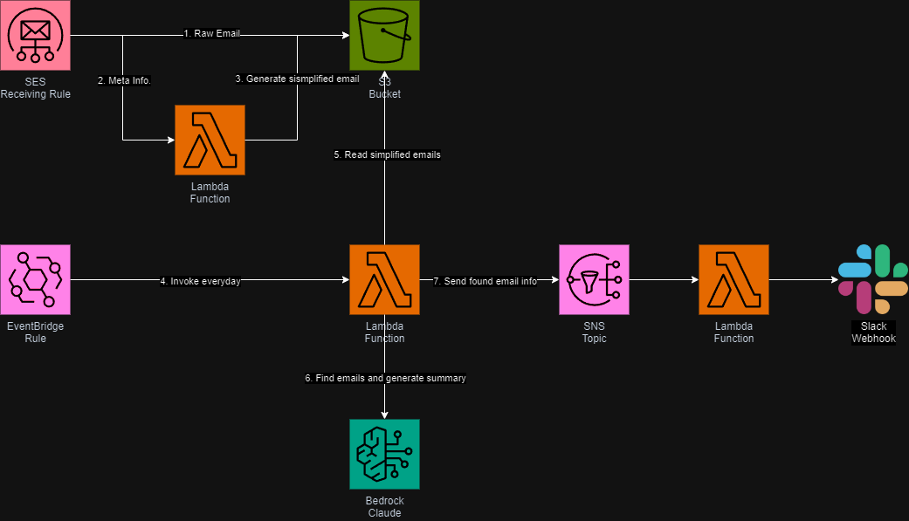

# Email Analysis

受信したメールから請求や契約内容に関するものを Slack に通知します。

## 仕組み



- SESで受信したメールを S3 に保存します
- 日時で前日に受信したメールを取得し Bedrock でメールの抽出と要約を実行します
- 抽出したメールの要約を Slack で通知します

## デプロイ
### 事前準備
#### 1. 環境変数の設定
- `AWS_ACCOUNT`
  - デプロイ対象の AWS アカウント ID
  - 必須: yes
- `AWS_REGION`
  - デプロイ対象の AWS リージョン
  - 必須: yes
- `RECEIVING_EMAILS`
  - 受信するメールアドレスのリスト (カンマ区切り)
      - ここで指定したメールアドレスで受信したメールが処理対象となります
  - 必須: yes
- `HOSTED_ZONE_NAME`
  - MX レコードを登録する対象のホストゾーン名
    - 指定したホストゾーンに対して受信用メールアドレスに対応した FQDN で MX レコードが作成されます
    - 指定しない場合、自身で MX レコードを設定する必要があります
  - 必須: no
- `EXISTING_RULE_SET_NAME`
  - 存在する受信ルールセット名
    - 指定した受信ルールセットに対して受信ルールが追加されます
    - 指定しない場合、新規に受信ルールセットが作成されます
  - 必須: no
- `TIMEZONE`
  - タイムゾーン
    - 指定したタイムゾーンに従って「昨日」が判定されます
  - 必須: yes
- `SLACK_WEBHOOK_URL`
  - Slack Webhook URL
  - 必須: yes
- `POWERTOOLS_LOG_LEVEL`
  - AWS Lambda powertools 用
  - 必須: no
- `SENTRY_DSN`
  - Sentry 用
  - 必須: no

#### 2. SES Identity の作成
受信ルール作成のために受信用メールアドレスのドメインに対して SES の Identity を作成します。
一時的に別のメールサーバでの受信設定をすることでメールアドレス Identity で対応することも可能です。

#### 3. (OPTIONAL) MX レコードの設定
`HOSTED_ZONE_NAME` を指定しない場合、手動で MX レコードを設定します。

### CDK Deploy
以下のように仮想環境を作成後 CDK アプリケーションをデプロイします。
```sh
# 仮想環境を作成してアクティベート
$ python3 -m venv .ven
$ source .venv/bin/activate

# パッケージをインストール
(.venv)$ pip install -r requirements.txt

# デプロイ
(.venv)$ cdk deploy
```
